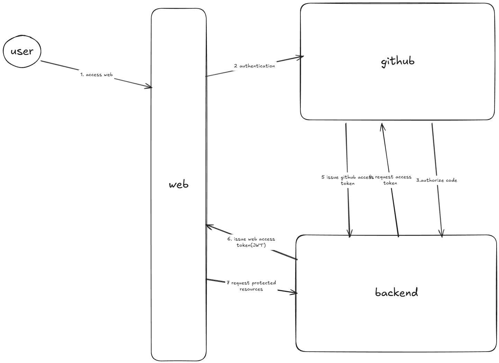

# Align Test Project

## How to Run the Project

### Prerequisites
- Node.js (18+ recommended)
- pnpm (or npm/yarn)

### Install dependencies

```
pnpm install
```

### Start the Frontend

```
pnpm dev
```

### Start the Backend (API)

```
cd backend
pnpm install
pnpm dev
```

### Run Tests

```
// tests to be added
```

---

## Authentication Approach Explanation

- 集成github Oauth 服务，通过github来认证用户
- 认证成功后采用 JWT（JSON Web Token）进行前后端分离的认证。
- 前端存储该 token 并在后续请求中通过 Authorization 头携带。
- 后端接口通过中间件/工具（如 utils/jwt.ts）校验 token 的有效性和过期时间，非法或过期 token 会返回 401。

---

## Tradeoffs and Improvements with More Time

- 目前 JWT 密钥和配置为硬编码，生产环境应使用环境变量管理密钥, 使用更符合安全标准生成token
- Token 只做了基本校验，未实现刷新机制（refresh token），可提升用户体验和安全性。
- 权限控制较为基础，可扩展为基于角色的访问控制（RBAC）。
- 错误处理和日志可进一步完善，异常处理， errorBoundary等
- 前端UI可以引入统一的样式库，增加易用性。
- 根据业务需求，项目规模来进行性能提升，如分包， 懒加载等。
- 测试覆盖率可提升，增加UT， 增加E2E测试。

---
